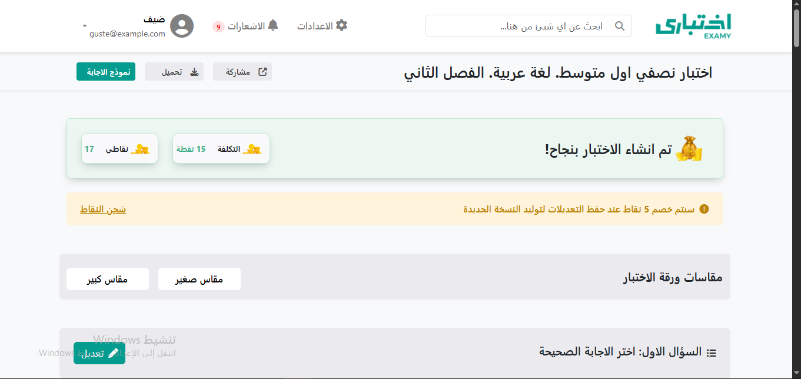
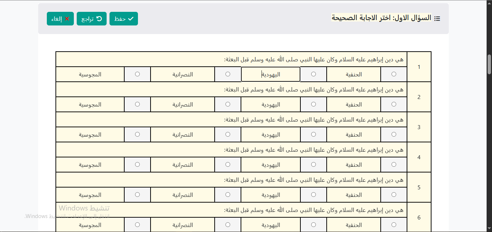

# 📚 اختباري دوت كوم

**اختباري دوت كوم** هو تطبيق ويب تفاعلي لإنشاء وإدارة أوراق الاختبارات بطريقة سهلة ومنظمة.  
يتيح للمستخدم تعديل الأسئلة، تغيير الخيارات، وتخصيص الاختبار قبل طباعته أو مشاركته.

---

## ✨ المميزات

- 🖋 **تعديل الأسئلة مباشرة** من الصفحة.
- 📑 **حفظ، تراجع، وإلغاء** التغييرات بسهولة.
- 📄 دعم مقاسات ورق مختلفة (صغير / كبير).
- 📷 إمكانية إضافة صور داخل الأسئلة.
- 🎨 تصميم عصري باستخدام **Bootstrap 5** و **Font Awesome**.
- 📱 متجاوب مع جميع الأجهزة.

---

## 📷 لقطات شاشة

### 🖥 الواجهة الرئيسية



### 📝 تعديل سؤال



---

## 🚀 كيفية التشغيل محلياً

1. **استنسخ المشروع**:
   ```bash
   git clone https://github.com/USERNAME/REPOSITORY_NAME.git
   ```
2. **افتح المجلد**:
   ```bash
   cd REPOSITORY_NAME
   ```
3. **افتح ملف `index.html`** مباشرة في المتصفح، أو استخدم خادم محلي مثل:
   ```bash
   npx live-server
   ```

---

## 📂 هيكل المشروع

```
├── index.html        # الصفحة الرئيسية
├── style.css         # تنسيقات الموقع
├── script.js         # وظائف جافاسكربت
├── static/           # صور وأيقونات الموقع
└── README.md         # ملف الشرح
```

---

## 🛠️ التقنيات المستخدمة

- **HTML5**
- **CSS3**
- **JavaScript**
- **Bootstrap 5**
- **Font Awesome**

---

## 📜 الترخيص

هذا المشروع مفتوح المصدر ويمكنك استخدامه أو تعديله بحرية.
